# cursus Maintainer's Guide

A durable workflow engine for React. Workflows are generator functions that yield commands; an interpreter executes them, records every step in an append-only event log, and replays from that log on reload.

---

## Architecture Overview

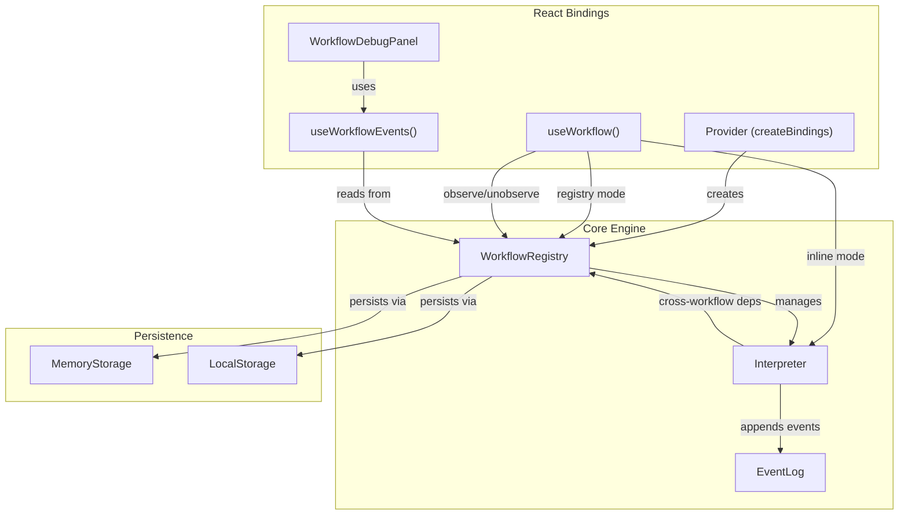

---

## The Generator Protocol

Workflows are generator functions. They `yield` **commands** to the interpreter and receive **results** back. The interpreter decides _how_ to execute each command (run it live, or replay it from the log).

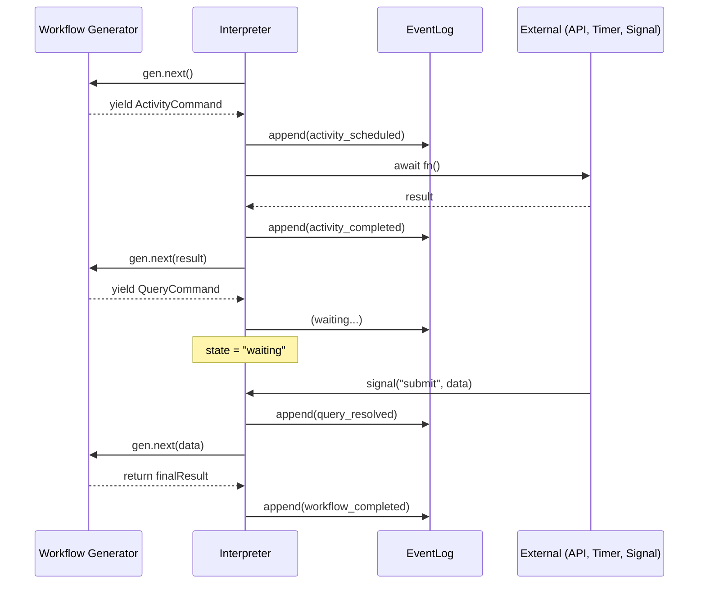

### Command Types

| Command | What it does | Free function |
|---------|-------------|---------------|
| `ActivityCommand` | Run an async function | `activity(name, fn)` |
| `QueryCommand` | Block until a named query is resolved (signal or workflow dep) | `query(label)` |
| `AllCommand` | Wait for multiple branches concurrently | `all(...)` |
| `RaceCommand` | Race branches, first to complete wins | `race(...)` |
| `SleepCommand` | Block for a duration | `sleep(ms)` |
| `ChildCommand` | Run a child workflow with its own event log | `child(name, wf)` |
| `PublishCommand` | Publish a value to consumers | `publish(value)` |
| `LoopCommand` | Repeat a body until break | `loop(body)` |
| `LoopBreakCommand` | Exit a loop with a value | `loopBreak(value)` |

---

## Event Sourcing and Replay

Every command execution records events in an append-only log. On reload, the interpreter replays the generator through recorded events without re-executing side effects.

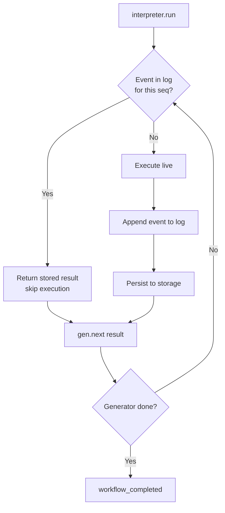

### How replay works

Each command gets a monotonically increasing **sequence number** (`seq`). Before executing any async command, the interpreter checks the event log:

```
seq=1: activity "fetch-user" → log has activity_completed(seq=1) → return stored result
seq=2: query "confirm"      → log has query_resolved(seq=2)     → return stored value
seq=3: activity "send-email" → no matching event                → execute live
```

The generator is deterministic (same inputs produce same yields), so replaying old results through it fast-forwards to the exact point where new work begins.

### Non-determinism detection

If an activity's name changes between the original run and replay (e.g., code was refactored while events are persisted), the interpreter throws:

```
Non-determinism detected: activity at seq 2 was "fetch-user" but is now "get-profile"
```

### Event Types

| Event | Recorded when |
|-------|--------------|
| `workflow_started` | `run()` begins |
| `activity_scheduled` | Activity execution starts |
| `activity_completed` | Activity returns a result |
| `activity_failed` | Activity throws an error |
| `query_resolved` | A query is resolved |
| `timer_started` / `timer_fired` | Sleep begins / ends |
| `child_started` / `child_completed` / `child_failed` | Child workflow lifecycle |
| `all_started` / `all_completed` | `all()` lifecycle |
| `race_started` / `race_completed` | `race()` lifecycle |
| `workflow_published` | Workflow published a value |
| `workflow_completed` / `workflow_failed` | Workflow terminal state |

---

## The Type System

### Workflow<A, R>

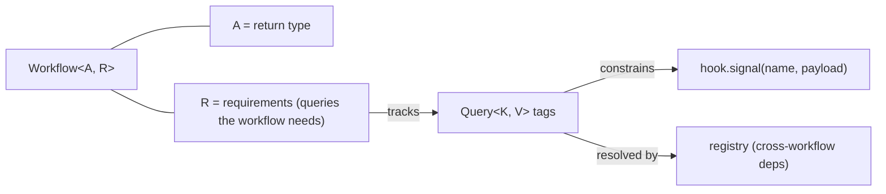

`Workflow<A, R>` is a class wrapping a generator factory. `A` is the return type, `R` is a union of `Query<K, V>` requirement tags that propagate upward through composition (like Effect-TS).

**Example:**

```typescript
const checkoutWorkflow = workflow(function* () {
  const [payment, profile] = yield* all(
    query<PaymentInfo>("payment"),
    query<UserProfile>("profile"),
  );
  return yield* activity("place-order", async () => ({
    orderId: "123",
    user: profile.name,
  }));
});
// Type: Workflow<Order, Query<"payment", PaymentInfo> | Query<"profile", UserProfile>>
```

Requirements propagate through `yield*`, `child()`, `all()`, and `race()`. The registry verifies at build time that all requirements are satisfied.

### Descriptors vs Commands

Free functions yield **descriptors** (no `seq`). The interpreter assigns a monotonic `seq` to produce **commands**:

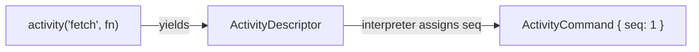

This separation keeps workflow code deterministic — the generator never sees or depends on sequence numbers.

---

## The Registry

The registry manages shared workflow instances, enables cross-workflow dependencies, and handles observer registration for inline workflows.

```mermaid
graph TB
    subgraph "WorkflowRegistry"
        ENTRIES["entries: Map&lt;string, WorkflowEntry&gt;"]

        subgraph "Entry: profile"
            E1_FN["fn: profileWorkflow"]
            E1_INT["interpreter: Interpreter"]
            E1_OBS["observed: false"]
            E1_WAIT["waiters: []"]
            E1_LIST["listeners: [syncState, forceRender]"]
        end

        subgraph "Entry: checkout (observed)"
            E2_FN["fn: (stub)"]
            E2_INT["interpreter: Interpreter"]
            E2_OBS["observed: true"]
            E2_WAIT["waiters: []"]
            E2_LIST["listeners: [forceRender]"]
        end
    end

    BUILD["createRegistry(storage).add('profile', wf).build()"] -->|constructor| ENTRIES
    UW_INLINE["useWorkflow('checkout', fn)"] -->|observe()| ENTRIES
```

### Entry Types

| Field | Purpose |
|-------|---------|
| `fn` | The workflow function (stub for observed entries) |
| `interpreter` | The running interpreter instance |
| `observed` | `true` if added via `observe()`, `false` if from the registry |
| `completed` / `failed` | Terminal state flags |
| `waiters` | Promises from other workflows waiting on this one |
| `listeners` | State change callbacks (from hooks) |

### Cross-Workflow Dependencies

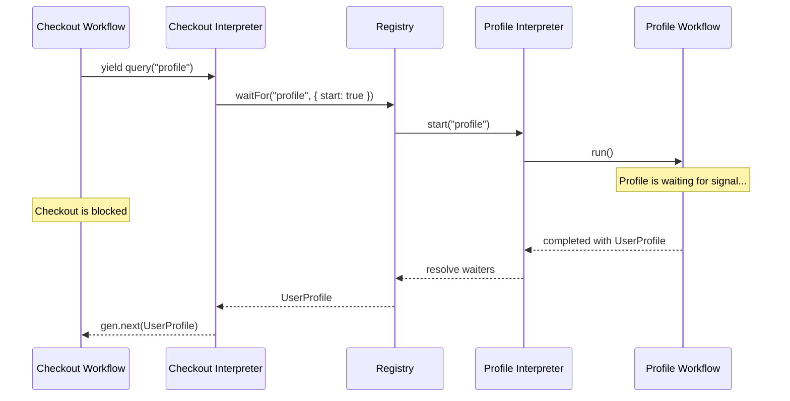

### observe / unobserve

Inline workflows register themselves with the registry so other workflows can depend on them:

```
mount:   useWorkflow("checkout", fn) → observe("checkout", interpreter)
unmount: cleanup                     → unobserve("checkout")
```

`observe()` behavior:
- **New entry**: Creates it with `observed: true`, notifies workflows-change listeners
- **Existing observed entry**: Replaces the interpreter (handles React StrictMode re-mounts)
- **Existing registry entry**: No-op (registry workflows are never overridden)

---

## React Integration

### useWorkflow: Two Modes

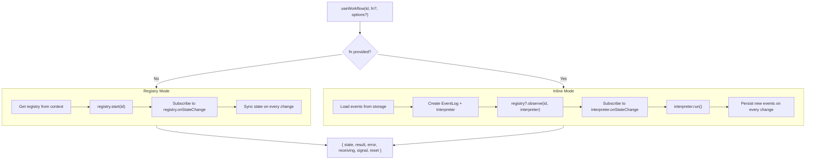

### Provider Structure

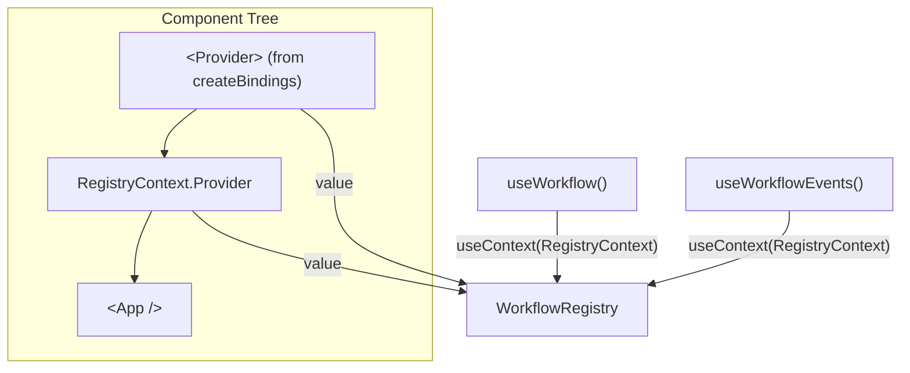

### Signal Flow Through React

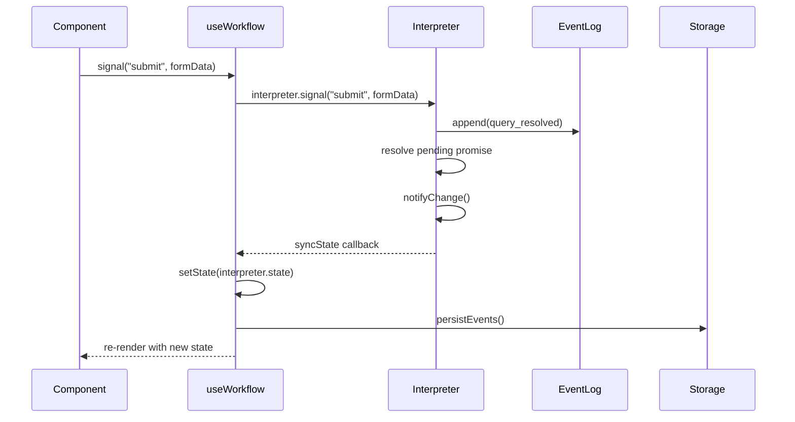

### React StrictMode

StrictMode runs effects twice: mount → cleanup → remount. The hook handles this:

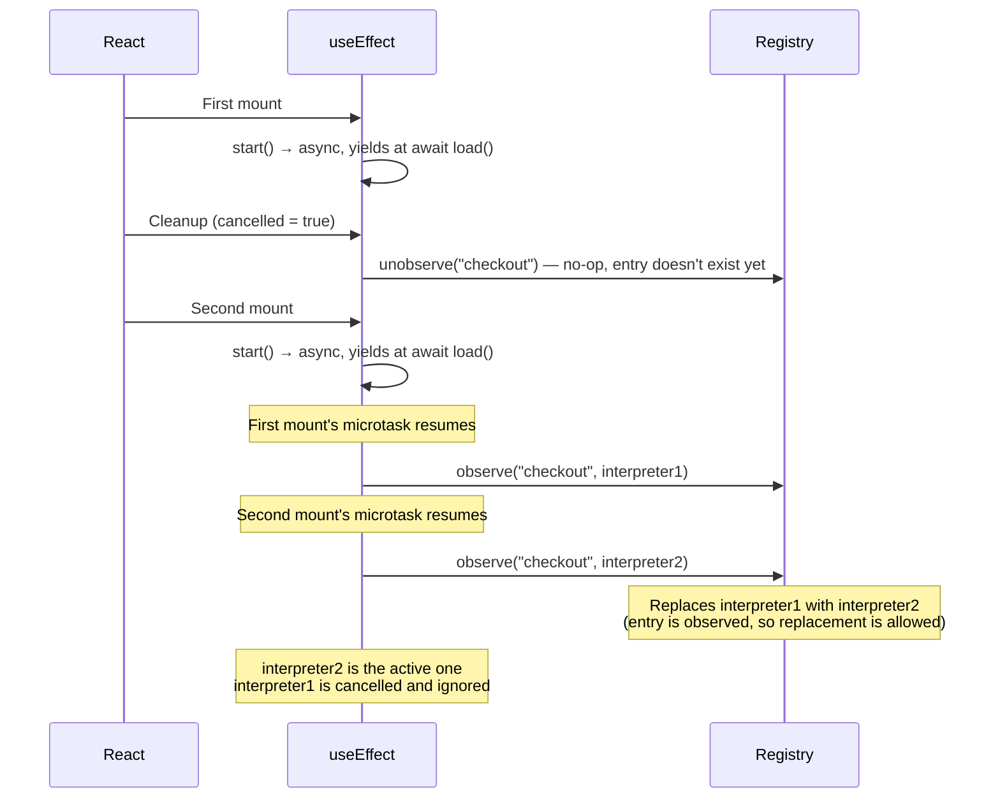

---

## Storage and Persistence

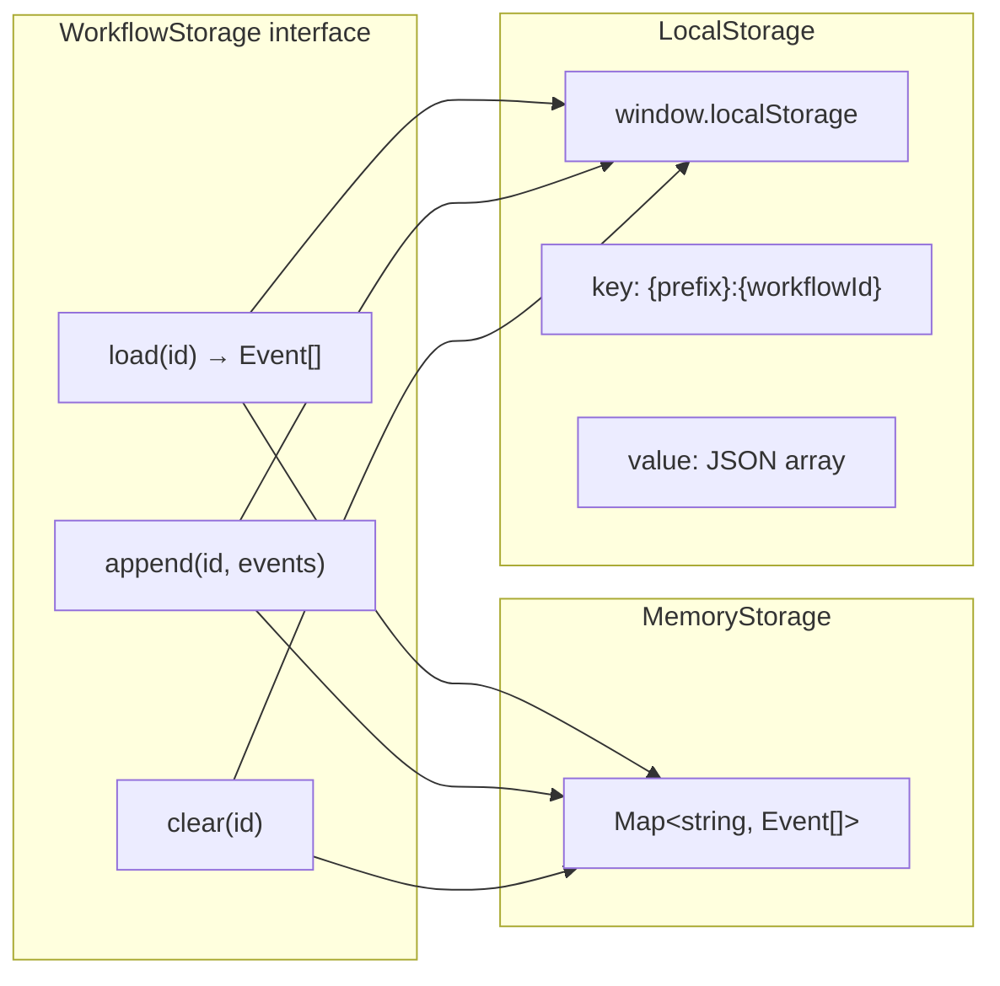

Events are persisted **incrementally**. The hook tracks `persistedCount` and only appends new events since the last persist. This avoids rewriting the entire log on every state change.

---

## Event Notification System

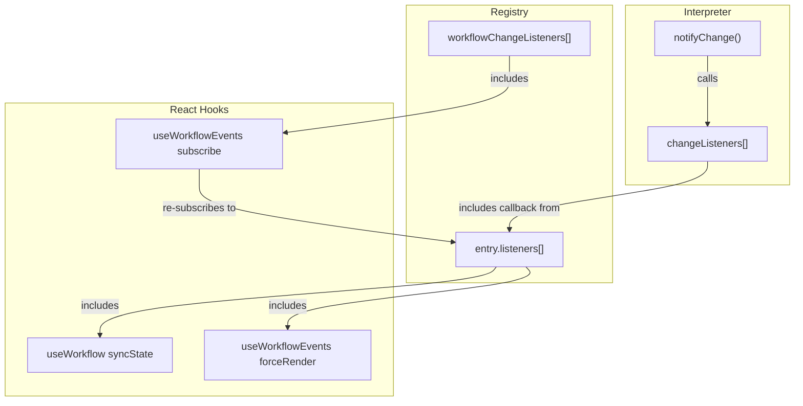

**Notification chain:**
1. Interpreter state changes → `notifyChange()` → calls `changeListeners`
2. Registry's observer callback (set up in `observe()` or `start()`) → iterates `entry.listeners`
3. Hook callbacks: `syncState` updates React state, `forceRender` triggers debug panel re-render
4. When workflows are added/removed → `notifyWorkflowsChange()` → `useWorkflowEvents` re-subscribes

---

## Testing with createTestRuntime

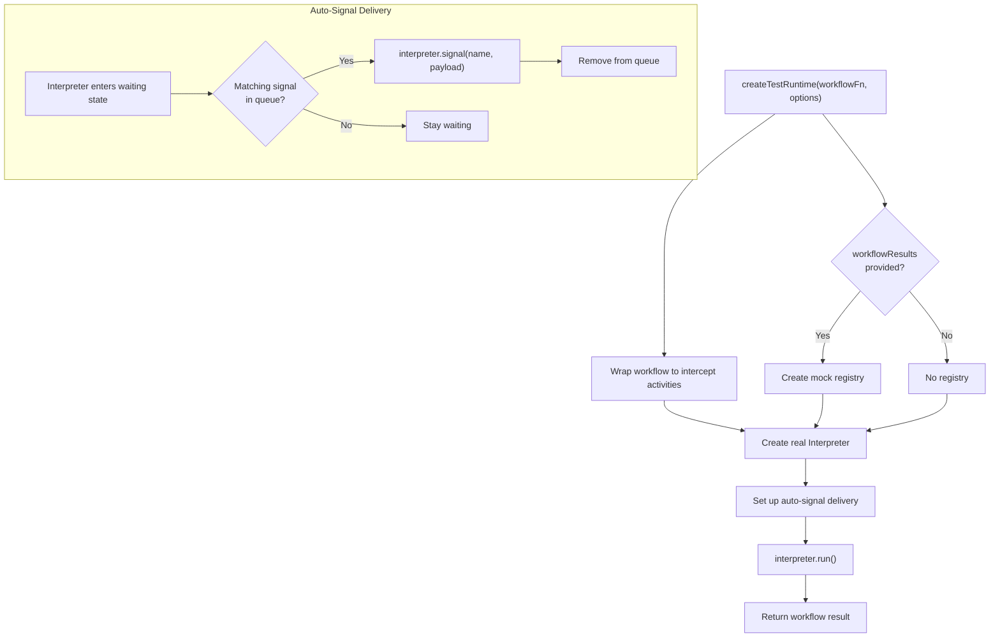

The test runtime uses the **real interpreter** — no mocking of the execution engine. Only activities, signals, and workflow dependencies are stubbed:

```typescript
// Activities: replace async functions with synchronous mocks
const result = await createTestRuntime(workflow, {
  activities: { "send-email": () => ({ sent: true }) },
});

// Signals: auto-delivered when the workflow waits for them
const result = await createTestRuntime(workflow, {
  signals: [{ name: "confirm", payload: { approved: true } }],
});

// Cross-workflow deps: mock other workflow results
const result = await createTestRuntime(workflow, {
  workflowResults: { auth: { userId: "123" } },
});
```

---

## File Map

```
src/
  types.ts              Commands, events, descriptors, storage interface
  event-log.ts          Append-only in-memory event log
  interpreter.ts        Core execution engine (run loop, replay, signals)
  registry.ts           Shared workflow management, cross-workflow deps
  registry-builder.ts   Type-safe builder: createRegistry().add().build()
  storage.ts            MemoryStorage and LocalStorage implementations
  bindings.ts           createBindings() — typed Provider, useWorkflow, usePublished
  registry-provider.tsx RegistryContext (shared React context)
  use-workflow.ts       useWorkflow() hook (inline + registry modes)
  use-published.ts      usePublished() selector hook (useSyncExternalStore)
  use-workflow-events.ts useWorkflowEvents() hook (debug/inspection)
  debug-panel.tsx       WorkflowDebugPanel component
  devtools-data.ts      Framework-agnostic timeline data layer
  test-runtime.ts       createTestRuntime() for testing workflows
  index.ts              Core entry point (React-free)
  react.ts              React bindings entry point
  devtools.ts           Devtools entry point (data layer + React panel)
```

---

## Key Invariants

1. **Event logs are append-only.** Events are never modified or deleted. This is the foundation of replay correctness.

2. **Generators must be deterministic.** Given the same inputs (replayed event results), a workflow must yield the same sequence of commands. Non-determinism is detected and throws.

3. **Sequence numbers are monotonic.** Each command gets the next `seq` value. This is how the interpreter matches commands to their recorded events during replay.

4. **Registry entries are never overridden by observe().** Only entries created via `observe()` (with `observed: true`) can have their interpreter replaced. This prevents inline workflows from clobbering registry-registered workflows.

5. **Storage persistence is incremental.** Only new events (since last persist) are appended. The hook tracks `persistedCount` to avoid redundant writes.

6. **Cleanup cancels but doesn't destroy.** The `cancelled` flag prevents state updates after unmount, but the interpreter may still be running asynchronously. This is safe because the cancelled interpreter's state changes are ignored.
